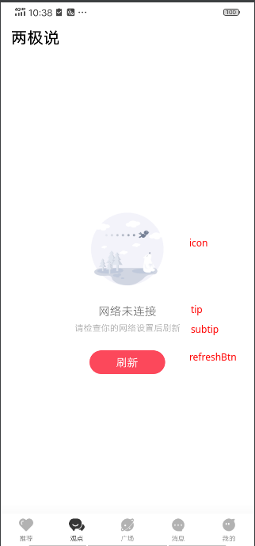

# EmptyView的使用

当页面（特别时列表页面）的数据为空时，页面可能会一片空白，这很影响美观甚至影响功能正常使用。 所以一般会展示一个页面提示用户当前没数据是网络问题还是其他原因。

List/PagerAbility支持当数据为空时自动展示空页面的能力，考虑到同个项目中的空页面UI可能一致或者大部分类似，
我们可以设置一个全局统一的空页面样式甚至是字体颜色、大小、间距等，如果某个页面要变更某些参数只需更改与全局样式不一样的参数。

例如我们先配置全局的空页面：

1. 设置网络未连接的默认空页面

```
DefaultEmptyConfig.configNetDisconnectBuilder {
    // 默认icon图标ui
    icon {
        setImageResource(R.mipmap.empty_net_disconnect)
        updateLayoutParams {
            width = 150.idp
            height = 150.idp
        }
    }
    tip {
        text = "网络未连接"
        setTextColor(R.color.gray_666)
        textSize = 13f
    }
    subTip = "请检查你的网络设置后刷新"
    refreshBtn {
        isVisible = true
        text = "刷新"
        setRoundBg(Color.WHITE, 15.dp)
    }
}
```

2. 设置网络不可用的默认空页面

```
DefaultEmptyConfig.configNetDisconnectBuilder {
    tip = "网络异常"
    subTip = "请检查你的网络设置后刷新"
    btnVisible = true
    btnText = "刷新"
    iconDrawable = R.mipmap.empty_net_unavailable
}
```

3. 设置数据为空的空默认页面

```
DefaultEmptyConfig.configEmptyDataBuilder {
    tip = "no data found"
    subTip = "try again"
    btnVisible = true
    btnText = "retry"
    iconDrawable = R.mipmap.empty_data
}
```

效果大致为


当因网络未连接或不可用、接口返回空数据而造成页面为空时都会调用此方法，若此状态的空页面与上面配置的全局样式一致时可不另做处理， 否则重写setupEmptyView，并根据对应状态配置相关参数

```
 override fun setupEmptyView(builder: EmptyBuilder) {
    // 需要改什么状态的空页面就覆写什么状态的EmptyBuilder，若不设置其他情况则使用默认配置
    builder.whenDataIsEmpty {
        // 数据为空是
        icon {
            setImageResource(R.mipmap.ic_launcher)
        }
        //or iconDrawable = Color.GREEN.toDrawable()
        tip {
            text = "no repository found"
        }
        //or  tip = "no data found"
        subTip {
            text = "try again"
        }
        //or subTip = "try again"
        refreshBtn {
            text = "retry"
        }
        //or btnText = "retry"
    }.whenDisconnect {
        // 网络未链接时
        ...
    }.whenUnavailable {
        // 网络不可用时
        ...
    }
}
```

另外空数据状态的原因除了接口返回空数据外还包括接口请求发生错误导致的空数据，这两种情况都包含在whenDataIsEmpty条件中。
如果需要根据接口发生的错误设置不同内容的空页面需要在闭包内根据接口错误原因调整

```
builder.whenDataIsEmpty {
    tip = "no data found"

    val resource = viewModel.resource
    if (resource.isError) {
        val error = resource.error as? ServicesException
        if (error?.code == 4003) {
            tip = "暂没权限访问"
        }
    }
}
```

列表的空页面的刷新按钮点击事件默认是接口刷新，如需更改，配置refreshBtn的点击事件即可

```
refreshBtn {
    text = "retry"
    setOnClickListener {
        // do something
    }
}
```

