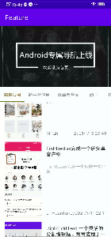
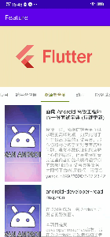

# ListAbility/PagerAbility

项目中带刷新和分页的列表页面占比绝不在少数，一般开发者都会定义BaseListActivity/Fragment/Dialog封装相应的功能。 相信有过封装经验的开发者都会遇到一些问题：

- 这3种不同类型的页面都需要相同的列表功能，那么类似的代码要复制3份，优雅点的会使用代理模式解决。但也免不了在3个Base中添加一些重复的代码。
- 项目一般会有个基础库，基础库会有BaseActivity/Fragment/Dialog封装一些基础的业务，因此BaseListXxx需要继承对应的BaseXxx以拥有Base的方法，
  除了BaseActivity外有时还会封装项目级的公共页面（例如CommonActivity）以让每个页面拥有项目上的某些通用实现，比如在打开和关闭页面时执行页面统计等。
  如此的话是否还要有CommonListActivity/Fragment/Dialog？CommonListActivity该继承BaseListActivity还是CommonActivity？
- 多层继承;

[解决方案](../feature/readme/ability.md)： 采用横向扩展方式代替纵向扩展

> 添加依赖

```
implementation "com.github.runnchild.Feature:list:$latest_version"
```

注：本库是基于[BaseQuickAdapter](https://github.com/CymChad/BaseRecyclerViewAdapterHelper) 3.0+提供的解决方案，
不过此库相较于3.0以下的版本，变化实在太大，如果项目中已经使用的是2.+的版本，几乎无法无损升级。若项目中已使用低版本的Adapter并且无法升级或不想升级，本库贴心的提供低版本的兼容方案;

> adapter3.0以下时，添加依赖：

```
implementation ("com.github.runnchild.Feature:list:$latest_version") {
    exclude group: "com.github.CymChad"
}
implementation "com.github.runnchild.Feature:adaptercompat:$latest_version"
```

以demo中首页为例，看下如何优雅实现这个页面：


> 1.页面解析：

1. 顶部用ViewPager2实现的轮播图；
2. 中间TabLayout用于为底部可切换页面做指示；
3. 底部为搭配FragmentPagerAdapter实现的可切换页面的ViewPager2；

页面虽然有两个ViewPager2，但给页面注册PagerAbility时一般选主要ViewPager的作为对象, 因此banner就单独实现了

> 2.xml编写：

1. banner: ViewPager2内部实现为RecyclerView，所以把他当成RecyclerView用好了：

```banner
<androidx.viewpager2.widget.ViewPager2
   android:id="@+id/viewPager"
   android:layout_width="match_parent"
   android:layout_height="200dp"
   // 自动滚动
   app:auto_scroll="@{true}"
   // 添加item样式
   app:itemBinderName='@{"com.rongc.wan.ui.WanBannerBinder"}'
   app:layout_constraintStart_toStartOf="parent"
   app:layout_constraintTop_toTopOf="parent"
   // 自动轮播
   app:loop="@{true}"
   // 绑定数据
   app:items="@{viewModel.banners.data}"
   // 滚动间隔
   app:scroll_interval="@{5000}" />
```

2. TabLayout 没啥好说

```
<com.google.android.material.tabs.TabLayout
   android:id="@+id/tabStrip"
   style="@style/MyTablayoutstyle"
   android:layout_width="match_parent"
   android:layout_height="wrap_content"
   app:tabMode="scrollable"
   app:layout_constraintStart_toStartOf="parent"
   app:layout_constraintTop_toBottomOf="@id/viewPager" />
```

3. 底部ViewPager2，因为下拉刷新等功能放在内部的子页面上，所以这里简单绑定items分类数据就行，如果ViewPager2也需要刷新和加载功能，可仿照base_recycler_with_refresh.xml添加RefreshLayout

```
<androidx.viewpager2.widget.ViewPager2
   android:id="@+id/pagerList"
   android:layout_width="match_parent"
   android:layout_height="0dp"
   app:items="@{viewModel.tabs}"
   app:layout_constraintBottom_toBottomOf="parent"
   app:layout_constraintTop_toBottomOf="@id/tabStrip" />
```

> 3.Fragment编写

```
class WanHomeFragment : BaseFragment<FragmentWanHomeBinding, WanHomeViewModel>(), IPagerHost {
    
    /**
     * 返回需要PagerAbility的ViewPager
     */
    override val viewPager: ViewPager2 get() = mBinding.pagerList

    override fun onViewCreated(view: View, savedInstanceState: Bundle?) {
        // 注册PagerAbility
        registerAbility(PagerAbility(viewModel, this))

        // 分类数据请求结果订阅，ignoreLoading()为忽略加载中状态只关心结果
        // whenSuccess，只在请求成功后接收通知
        viewModel.result.whenSuccess(lifecycleOwner) {
            // 配置TabLayout
            it.data?.forEach { project ->
                val tab = mBinding.tabStrip.newTab()
                tab.text = project.name
                mBinding.tabStrip.addTab(tab)
            }

            TabLayoutMediator(
                mBinding.tabStrip, mBinding.pagerList, true, true
            ) { tab, position ->
                tab.text = it.data?.getOrNull(position)?.name ?: ""
            }.attach()
        }
    }

    /**
     * 若ViewPager2子页面非View（是Fragment）时重载此方法返回BaseFragmentPagerAdapter
     */
    override fun providerAdapter(): RecyclerView.Adapter<*> {
        return object : BaseFragmentPagerAdapter<String>(this) {
            override fun createItemFragment(item: String, position: Int): IPagerItem<String> {
                // 根据position返回子页面
                return ProjectListFragment().apply {
                    arguments = bundleOf("cid" to item)
                }
            }
        }
    }

    /**
     * BaseFragmentPagerAdapter照样支持空页面
     */
    override fun setupEmptyView(builder: EmptyBuilder) {
        builder.whenDataIsEmpty {
            tip = "no data"
        }
    }
}
```

> 4. ViewModel编写

```
class WanHomeViewModel : BaseListViewModel<ProjectTree>() {
    private val repository = WanServiceProvider.wanRepository
    /**
     * 正常情况下（非业务需要多次调接口刷新数据）在ViewModel的生命周期内应该只调一次接口，
     * 避免在可能会多次执行的方法内直接获取（或可在请求前判断是否已有数据）接口数据，
     * 比如Fragment的onViewCreated/onCreateView，但可在这些方法内订阅，如有数据将立即得到通知。
     */
    val banners by lazy {
        repository.fetchBanners()
    }

    /**
     * 获取到分类数据后将原始数据变换为需要关注的分类id数组
     * 此处的result为#loadListData的返回结果
     */
    val tabs = result.map {
        it.data?.map { project ->
            project.id.toString()
        }
    }

    override fun loadListData(page: Int): LiveData<Resource<List<ProjectTree>>> {
        return repository.getProjectTree()
    }
}
```

> 5. 子页面编写： 子页面为标准的可刷新列表页面，只需注册ListAbility和添加ItemBinder

5.1 ProjectListFragment: UI直接使用内置的BaseRecyclerWithRefreshBinding

```
class ProjectListFragment : BaseFragment<BaseRecyclerWithRefreshBinding, ProjectListViewModel>(),
    IPagerItem<String>, IRecyclerHost {

    override val recyclerView: RecyclerView get() = mBinding.recyclerView

    override fun onViewCreated(view: View, savedInstanceState: Bundle?) {
        viewModel.cid.value = arguments?.getString("cid")
        // 注册ListAbility实现列表相关功能
        registerAbility(ListAbility(viewModel, this))
    }

    override fun registerItemBinders(binders: ArrayList<BaseRecyclerItemBinder<out Any>>) {
        // 添加列表Item样式Binder
        binders.add(ProjectItemBinder())
    }
}
```

5.2 ProjectListViewModel继承BaseListViewModel以拥有刷新、分页、空页面等处理能力

```

class ProjectListViewModel : BaseListViewModel<ProjectList>() {

    val cid = MutableLiveData<String>()

    private val repository = WanServiceProvider.wanRepository

    override fun loadListData(page: Int): LiveData<Resource<List<ProjectList>>> {
        return repository.getProjectList(page, cid.value!!).map {
            // 由于真正的列表数据包含在内层，所以这里需要转换
            Resource(it.status, it.data?.datas, it.error)
        }
    }
}
```

5.3 定义ProjectItemBinder

```
class ProjectItemBinder : BaseItemBindingBinder<ItemProjectListBinding, ProjectList>() {
    override fun convert(
        binding: ItemProjectListBinding, holder: BaseViewHolder, data: ProjectList
    ) {
        // ui绑定都在xml中做好，这里不需要其他实现
    }
}
```

5.4 ProjectItemBinder的UI

```
<?xml version="1.0" encoding="utf-8"?>
<layout xmlns:android="http://schemas.android.com/apk/res/android"
    xmlns:app="http://schemas.android.com/apk/res-auto"
    xmlns:tools="http://schemas.android.com/tools">

    <data>

        <!-- 如定义了名称为‘bean’的属性，Binder会自动为它赋值 -->
        <variable
            name="bean"
            type="com.rongc.wan.ProjectList" />
    </data>

    <androidx.constraintlayout.widget.ConstraintLayout
        android:layout_width="match_parent"
        android:layout_height="wrap_content">

        <ImageView
            android:id="@+id/iv_project"
            android:layout_width="120dp"
            android:layout_height="250dp"
            android:layout_marginStart="15dp"
            android:layout_marginTop="@dimen/dp_10"
            android:scaleType="centerCrop"
            app:layout_constraintStart_toStartOf="parent"
            app:layout_constraintTop_toTopOf="parent"
            app:url="@{bean.envelopePic}"
            tools:src="@color/black_30" />

        <TextView
            android:id="@+id/tv_name"
            android:layout_width="0dp"
            android:layout_height="wrap_content"
            android:layout_marginStart="15dp"
            android:layout_marginTop="@dimen/dp_10"
            android:layout_marginEnd="15dp"
            android:ellipsize="end"
            android:maxLines="2"
            android:text="@{bean.title}"
            android:textColor="#353535"
            android:textSize="16sp"
            android:textStyle="bold"
            app:layout_constraintEnd_toEndOf="parent"
            app:layout_constraintStart_toEndOf="@id/iv_project"
            app:layout_constraintTop_toTopOf="@id/iv_project"
            tools:text="project name" />

        <TextView
            android:layout_width="0dp"
            android:layout_height="0dp"
            android:layout_marginTop="20dp"
            android:ellipsize="end"
            android:text="@{bean.desc}"
            android:textColor="@color/black_40"
            app:layout_constraintBottom_toTopOf="@id/tv_author"
            app:layout_constraintEnd_toEndOf="@id/tv_name"
            app:layout_constraintStart_toStartOf="@id/tv_name"
            app:layout_constraintTop_toBottomOf="@id/tv_name"
            app:layout_constraintVertical_bias="0"
            tools:text="describe" />

        <TextView
            android:id="@+id/tv_author"
            android:layout_width="wrap_content"
            android:layout_height="wrap_content"
            android:layout_marginBottom="10dp"
            android:text="@{bean.author}"
            app:layout_constraintBottom_toBottomOf="@id/iv_project"
            app:layout_constraintStart_toStartOf="@id/tv_name"
            tools:text="author" />

        <TextView
            android:layout_width="wrap_content"
            android:layout_height="wrap_content"
            android:text="@{bean.publishTimeStr}"
            app:layout_constraintBaseline_toBaselineOf="@id/tv_author"
            app:layout_constraintEnd_toEndOf="@id/tv_name"
            tools:text="time" />
    </androidx.constraintlayout.widget.ConstraintLayout>
</layout>
```

如此，整个页面的编写工作就结束了，运行效果



## 进阶用法(以ListAbility为例，Pager类似)

页面在注册了ListAbility之后实现IRecyclerHost接口，接口定义了以下几个方法

```
    /**
     * 默认使用BaseBinderAdapter，如果需要提供新Adapter, 重写此方法返回需要设置的Adapter
     * note：返回的Adapter若不是继承BaseBinderAdapter则通过#registerItemBinders实现Item绑定不会生效
     */
    fun providerAdapter(): RecyclerView.Adapter<*>? = null

    /**
     * 是否进入页面立即获取数据
     */
    fun autoRefresh() = true

    /**
     * 配置空页面UI
     */
    fun setupEmptyView(builder: EmptyBuilder) {
    }

    /**
     * 如果不使用默认的空页面，重写并返回其他空页面
     * 如果不需要空页面返回null;
     */
    fun providerEmptyView(context: Context): IEmptyView? = EmptyView(context)

    /**
     * 配置列表分割线
     */
    fun decorationBuilder(): ItemDecoration.Builder.() -> Unit {
        return { }
    }

    /**
     * 添加列表item样式
     */
    fun registerItemBinders(binders: ArrayList<BaseRecyclerItemBinder<out Any>>) {
    }
```

+ providerAdapter(): 若无特殊要求，可不必编写Adapter，ability会使用友好支持多类型的BaseBinderAdapter。
+ autoRefresh()：进入页面是否立即请求数据，返回false进入页面后需要择时调用viewModel.refresh()请求数据。
+ [setupEmptyView(EmptyBuilder)](empty.md): 当（接口/网络引起的）数据为空时，此方法会被调用，可设置EmptyBuilder来实现页面的空页面样式；
+ providerEmptyView(Context): 若不使用内置的EmptyView，可返回自定义的空页面；
+ decorationBuilder()：列表装饰，一般用于设置item间隔；

```
override fun decorationBuilder(): ItemDecoration.Builder.() -> Unit {
   return {
       // 根据不同LayoutManager设置参数
       setVerticalLineWidth(10.idp)
       setHorizontalLineWidth(10.idp)
   }
}
```

+ registerItemBinders(ArrayList<BaseRecyclerItemBinder<out Any>>)
  ：添加列表Item样式，每个ItemBinder代表一种ItemType，Adapter会根据数据的元素类型匹配对应的ItemBinder；
  

